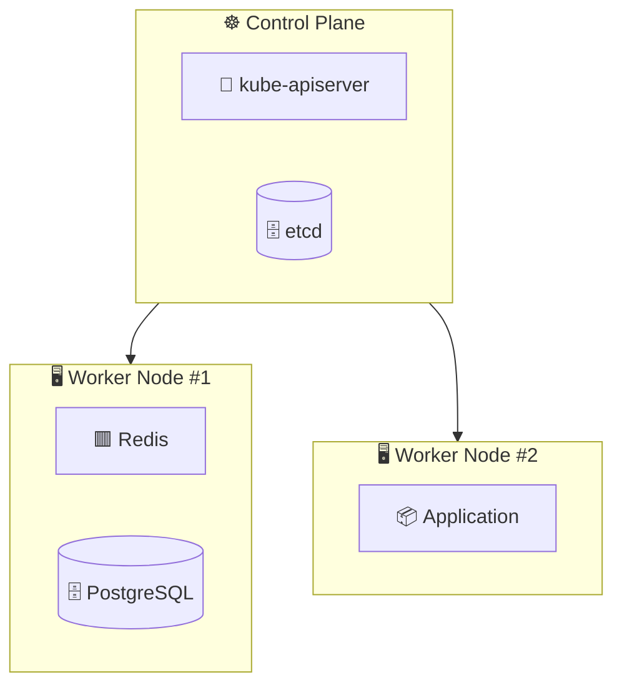
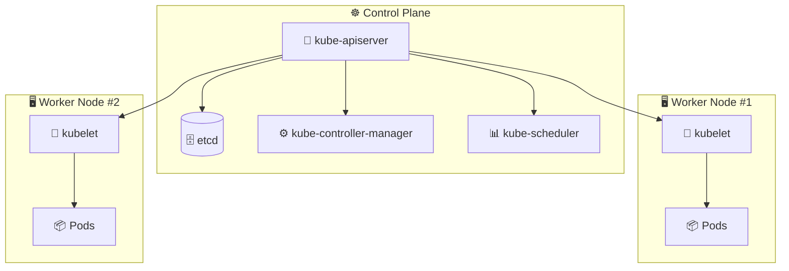
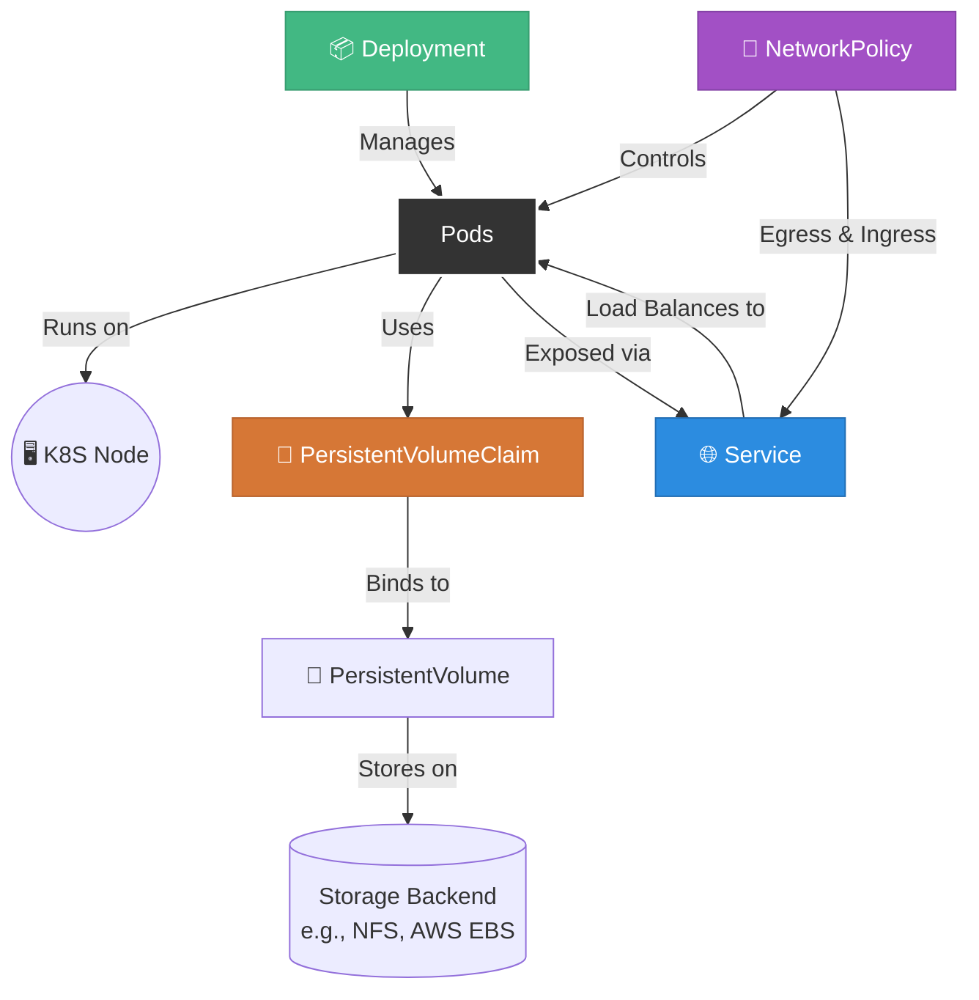
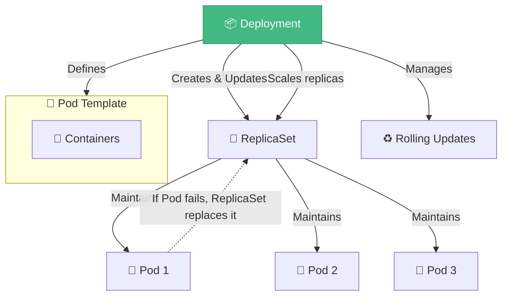

## Kubernetes

<div class="flex-center pl-45 pb-5 mt-[-60px]">
  
</div>

- You describe your system with **YAML specs** (Deployments, Services, etc.)
- All components interact with the **API server** as the single source of truth
- Desired state is stored in **etcd** (distributed key–value store)

- Controllers continuously compare **desired state** (YAML) vs **actual state** (Pods, Nodes) and reconcile differences
- Handles scheduling, scaling, rolling updates, networking, storage, health checks... all automatically

---

## Kubernetes Cluster

<div class="absolute-center" style="position: absolute; top: 50%; left:50%; transform: translate(-50%, -50%);">

</div>

---

## Kubernetes Cluster (close up)

<div class="absolute-center" style="position: absolute; top: 50%; left:50%; transform: translate(-50%, -50%);">

</div>

---

## "Simple" Deployment

<div class="absolute-center" style="position: absolute; top: 50%; left:50%; transform: translate(-50%, -50%);">

</div>

---

## Deployment

<div class="absolute-center" style="position: absolute; top: 50%; left:50%; transform: translate(-50%, -50%);">

</div>

---

## Deployment

```yaml {1-2|4|6-8|9|14-19|17|19|all}
apiVersion: apps/v1
kind: Deployment
metadata:
  name: nginx-deployment
spec:
  selector:
    matchLabels:
      app: nginx
  replicas: 2 # tells deployment to run 2 pods matching the template
  template:
    metadata:
      labels:
        app: nginx
    spec:
      containers:
        - name: nginx
          image: nginx:1.14.2
          ports:
            - containerPort: 80
```

---

## Core Resources

<div class="p-5"></div>

### 🔹 Workloads
- **Pod** 🐳 — smallest deployable unit, runs containers  
- **ReplicaSet** 📑 — ensures a specified number of Pods  
- **Deployment** 📦 — declarative updates for Pods/ReplicaSets  
- **StatefulSet** 📚 — manages stateful apps, stable IDs & storage  
- **DaemonSet** ⚙️ — runs a Pod on every Node  
- **Job** ⏳ — run Pods until completion  
- **CronJob** ⏰ — run Pods on a schedule  

### 🌐 Networking
- **Service** 🌐 — stable networking endpoint for Pods  
- **NetworkPolicy** 🔐 — control traffic rules  

---

## Core Resources

<div class="p-5"></div>

### 💾 Storage
- **PersistentVolume (PV)** 🧩 — cluster-wide storage resource  
- **PersistentVolumeClaim (PVC)** 💾 — request for storage  
- **ConfigMap** 📝 — store config as key-value pairs  
- **Secret** 🔑 — store sensitive data  

### 🖥️ Cluster
- **Node** 🖥️ — a worker machine  
- **Namespace** 📂 — logical partition of cluster resources  
- **ServiceAccount** 👤 — identity  
- **Role / ClusterRole** & **RoleBinding / ClusterRoleBinding** 🔒 — RBAC access control  