## 🛠️ Kubernetes Operators

What ?
- A **custom controller** for Kubernetes
- Extends Kubernetes with new APIs (Custom Resources)
- Encodes **human operational knowledge** into software

---

## 🛠️ Kubernetes Operators

Why ?
- Automates complex app lifecycle tasks
- Ensures apps stay in the **desired state**
- Reduces manual intervention & human error

> Operators let Kubernetes not only manage infrastructure, but also the **applications themselves** — like having a built-in SRE for your app.

---

## 🤖 Operators in the Wild  

- Usually to simplify/automate a specific task :
  - **MySQL Operator** 🗄️  
  - **Cert-Manager** 🔐 — manage TLS certificates 
  - **Jaeger Operator** 🔎 — distributed tracing  

---

## How ?

```mermaid {theme: 'neutral', scale: 0.75}
flowchart TD 
    subgraph Desired["📝 Custom Resource"]
    User[👩‍💻 User] --> API[📜 Kubernetes API Server]
    API --> ETCD[(etcd DB)]
    end

    API -->|Events| Queue[📬 Event Queue]

    subgraph Operator["🤖 Operator Controller"]
    Queue --> Reconcile[🔄 Reconcile Loop]
    end

    Reconcile --> App[📦 Application / Pods]
    App -->|Status| API

    API -.->|Compare Desired vs Actual| Reconcile
```

---

### 🛠️ Common Tools & Languages

- **Ansible**, or **Helm**  
- **Java (Java Operator SDK)**  
- **Python (Kopf framework)**  
- **Others**: Rust, C#, even Bash for simple cases  
- 🐹 **Go + Kubebuilder (most common)**
  - Default choice for most
  - Provides scaffolding, CRD generation, and best practices  
  - Integrates with k8s libraries

