```mermaid {theme: 'neutral', scale: 0.75}
graph TD
  %% Upstream dependencies
  CERT[🔑 certificate]
  WA[📦 webapp]
  ST[💾 storage]

  WA -->|Depends on| ST

  %% vhostroute
  VHR[🌐 vhostroute] -->|Depends on| CERT
  VHR -->|Depends on| WA

  %% vhostroute generated resources
  VHR --> GW[🚪 Gateway]
  GW --> HR[➡️ HTTPRoute]
  HR --> HRF[🧩 HTTPRouteFilter]
  HR --> BE[🎯 Backend]
  BE --> BTP[⚖️ BackendTrafficPolicy]
  VHR --> HR
  VHR --> HRF
  VHR --> BE
  VHR --> BTP

  %% Styles
  style VHR fill:#2c8ce0,stroke:#226db3,color:white
  style WA fill:#42b883,stroke:#389d70,color:white
  style ST fill:#d67736,stroke:#b8622c,color:white
  style CERT fill:#a250c5,stroke:#8442a6,color:white

  style GW fill:#ddd,stroke:#aaa,color:black
  style HR fill:#ddd,stroke:#aaa,color:black
  style HRF fill:#ddd,stroke:#aaa,color:black
  style BE fill:#ddd,stroke:#aaa,color:black
  style BTP fill:#ddd,stroke:#aaa,color:black
```

<!-- Slide 4: Multi-Operator Design -->
## Multi-Operator Design

Our platform is powered by **multiple Kubernetes Operators**,  
each focused on a **specific responsibility**:

| Operator      | Responsibility                      |
|---------------|--------------------------------------|
| `webapp`      | End-user workloads (apps & services) |
| `vhostroute`  | HTTP traffic routing                 |
| `sshroute`    | SSH access routing                   |
| `certificate` | Certificate storage & management     |
| `maintenance` | Maintenance page and/or fallback     |
| `storage`     | End-user volume declarations         |

---

## How it works

<div class="absolute-center" style="position: absolute; top: 50%; left:50%; transform: translate(-50%, -50%);">

</div>


---

## How it works

```yaml {all|2-3|4-6|8-11|12-14}
spec:
  .well-known:
    acme-challenge/test: test
  fqdns:
  - domaine.net
  - dsadasdsadas.preview.hosting-ik.com
  rules:
  - target:
      kind: Webapp
      name: webapp
    urlPrefix: /
  tls:
    kind: Certificate
    name: cert
```

---

<!-- Slide 6: Why Contracts? -->
## Why Use Contracts?

To keep operators **decoupled yet interoperable**,  
we use a **contract-based model**:

- One operator exposes the contract its expecting, and the other one can import it.
- Contracts are exposed via a field in the `.status` section
- Other operators can **read** those fields through reflection using `mapstructure`.

This gives us:

✅ Loose coupling  
✅ Extensibility  
✅ Independent lifecycles  

---
Example :

<div class="grid grid-cols-2 gap-8 items-center">

<div>

```yaml {all|11-20}
apiVersion: route.multi.ch/v1
kind: Route
metadata:
  generation: 2
  name: route-sample
  namespace: default
spec:
  hostnames:
  - 172.19.0.4
  targetRefs:
  - apiVersion: app.multi.ch/v1
    kind: App
    name: app-sample
    pathPrefix: /
```

</div>

<div>

```yaml {all|11-20}
apiVersion: app.multi.ch/v1
kind: App
metadata:
  name: app-sample
  generation: 2
spec:
  command: |
    /bin/bash -c "flask [...]
  port: 5000
status:
  routeContract:
    serviceRef:
      name: app-sample
      port: 80
```

</div>
</div>
