```mermaid {theme: 'neutral', scale: 0.75}
flowchart TD

    %% Custom Resource (top-right)
    subgraph Desired["📝 Custom Resource"]
      API[📜 Kubernetes API Server]
      ETCD[(etcd DB)]
      API --> ETCD
    end

    %% Operator Controller (bottom-left)
    subgraph Operator["🤖 Operator Controller"]
      Queue[📬 Event Queue] --> Reconcile[🔄 Reconcile Loop]
      OperatorAPI[🌐 API Endpoint]
    end
    
    User[👩‍💻 User] 

    %% Application
    Reconcile --> App[📦 Application / Pods]
    OperatorAPI --> SVC[🌐 Service]
    SVC --> App

    %% Flows between blocks
    App -->|Status| API
    API -.->|Compare Desired vs Actual| Reconcile
    API -->|Events| Queue

    %% Direct path
    User --> OperatorAPI


```

<!-- Slide 10: Beyond Reconciliation -->
## Beyond Reconciliation: Custom APIs

Sometimes, reconciling specs isn't enough.  
We needed to expose **actionable business logic** via APIs.

So we used the **Kubernetes Aggregation Layer**  
to serve **custom subresources** directly from our Operators.

This allowed us to build what we call... **Agents**.

---

## The problem

```mermaid {theme: 'neutral', scale: 0.75}
flowchart TD 
    subgraph Desired["📝 Custom Resource"]
    User[👩‍💻 User] --> API[📜 Kubernetes API Server]
    API --> ETCD[(etcd DB)]
    end

    API -->|Events| Queue[📬 Event Queue]

    subgraph Operator["🤖 Operator Controller"]
    Queue --> Reconcile[🔄 Reconcile Loop]
    end

    Reconcile --> App[📦 Application / Pods]
    App -->|Status| API

    API -.->|Compare Desired vs Actual| Reconcile
```

---

<!-- Slide 11: Agents Overview -->
## What Are Agents?

🧠 Agents are lightweight HTTP APIs embedded in our Operators.

They expose **operator-specific actions** via the Kubernetes API Server:

- Exposed as custom API services (`/apis/agent.webapp.infomaniak.com/v1/namespaces/default/webapps/myapp/run`)
- Implemented as **Subresources** handled by the Operator's HTTP server

Think of it like:  
💡 CRD = Spec definition  
🛠 Agent = Live control interface

---

---

<!-- Slide 12: Our Two Agents -->
## Our Two Agents

We currently deploy two agents:

### 🗄 Storage Agent 

- Returns status about the actual storage usage  

### 🖥 WebApp Agent 

- Control the lifecycle of the user's app in real time
